# RHEL 10 STIG Hardening Lab (OpenSCAP + Ansible)

This is a writeup of a lab I did on my own VM to practice compliance scanning and hardening on Red Hat Enterprise Linux. I run VMware Workstation instead of VirtualBox or Proxmox, and I used RHEL 10 instead of RHEL 9, so almost none of the commands from the tutorial I followed worked exactly as shown. This repo documents what I actually ran, what broke, and how I fixed it.

I am a final year cybersecurity student, so this was mainly to build a real skill (reading a compliance scan and actually fixing what it finds) instead of just watching a video about it.

## Purpose of the lab

The goal was to take a fresh RHEL install, scan it against a security baseline, and then actually fix what the scan flags, instead of just running a tool and looking at the output. This is basically what an ISSO, compliance analyst, or systems hardening person does before a system can be authorized to run in a government or enterprise environment.

Specifically the lab covers:

- Scanning a Linux system with OpenSCAP against the DISA STIG profile
- Understanding that a failed check is not just "red bad, green good" but ties back to an actual NIST 800-53 control
- Fixing one setting by hand (disabling direct root login over SSH) to see the before and after
- Using Ansible to automate the remaining fixes instead of doing them one by one
- Re-scanning and comparing the before and after report
- Troubleshooting all the environment issues that showed up along the way, since nothing about my setup matched the tutorial exactly

## My setup

- Hypervisor: VMware Workstation (not VirtualBox/Proxmox like most tutorials assume)
- OS: RHEL 10.0 (not RHEL 9, which is what most existing SSG content and tutorials are built for)
- Tools: openscap-scanner, scap-security-guide, ansible-core
- Profile used: `xccdf_org.ssgproject.content_profile_stig`

## Step by step, including everything that went wrong

### 1. Installing RHEL 10 in VMware

VMware's guest OS list only went up to RHEL 9 in the dropdown, since RHEL 10 was too new to be listed yet. I just selected RHEL 9 as the guest OS type and pointed it at the RHEL 10 ISO anyway. It installed and ran fine, this only affects some default hardware settings, not what actually gets installed.

During the install I had to manually fix four warning icons on the Installation Summary screen before I could begin install: register with Red Hat, pick a software set, enable the root account, and create a user.


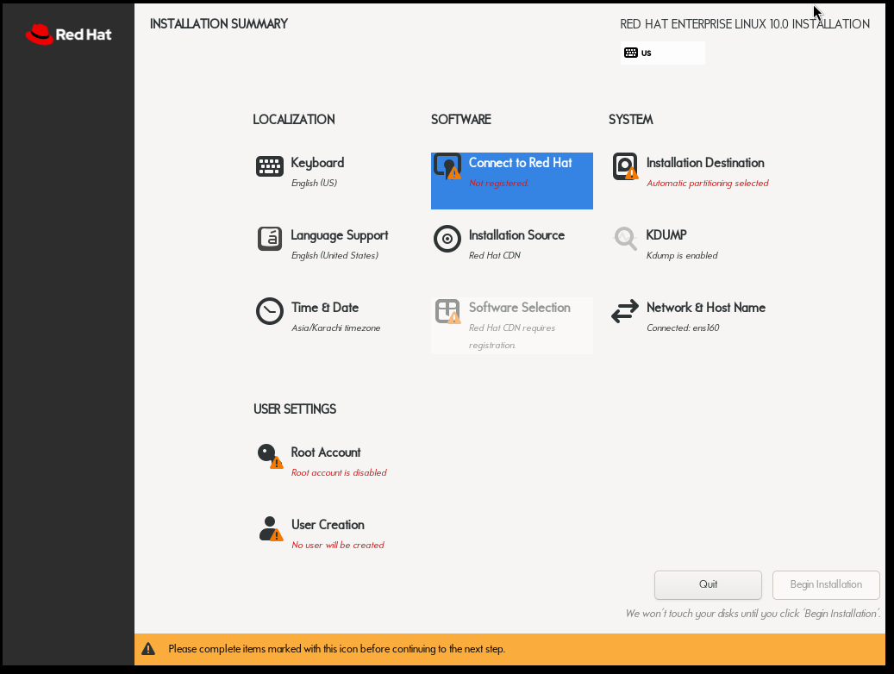


### 2. Snapshot before touching anything

Before changing any settings I took a VMware snapshot named `baseline-clean`. STIG remediation can genuinely lock you out of SSH or break the system, so this was my undo button in case anything went wrong.

VM menu > Snapshot > Take Snapshot in the GUI, or `vmrun snapshot` from the host if you want to script it.

### 3. Installing OpenSCAP

```bash
sudo dnf install -y openscap-scanner scap-security-guide ansible-core
```


### 4. Baseline scan, and the first round of errors

This is where things stopped matching the tutorial. I tried running the scan as a multi line command with backslashes, copy pasted, and it broke because of stray whitespace after the line continuation characters. The shell read `--profile` as if it was a filename.

```
OpenSCAP Error: Unable to open file: ' --profile'
```


Fixed it by just running it as one single line instead of multi line with backslashes.

Then hit a second error, this time the actual content file didn't exist where I expected:

```
OpenSCAP Error: Unable to open file: '/usr/share/xml/scap/ssg/content/ssg-rhel10-xccdf.xml'
```


Turns out RHEL 10 content ships as a "data stream" file, not the plain xccdf file the tutorial used, since it was made for RHEL 9. Checked what actually existed:

```bash
ls /usr/share/xml/scap/ssg/content/
```


Only `ssg-rhel10-ds.xml` existed. Swapped the filename and the scan finally ran:

```bash
sudo oscap xccdf eval --profile xccdf_org.ssgproject.content_profile_stig --results scan-results.xml --report baseline-report.html /usr/share/xml/scap/ssg/content/ssg-rhel10-ds.xml
```


### 5. Manual fix: disabling root login over SSH

This is the single check the tutorial focuses on to show how one setting maps to a real control (CCI to NIST 800-53).

```bash
echo 'PermitRootLogin no' | sudo tee /etc/ssh/sshd_config.d/01-stig-rootlogin.conf
sudo sshd -t && sudo systemctl restart sshd.service
```

First mistake here was just a typo, I typed `sytemctl` instead of `systemctl`. Easy fix.

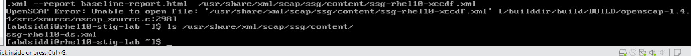

After fixing the typo the service restarted fine, but when I checked the actual running config it still said `yes`:

```bash
sudo sshd -T | grep permitrootlogin
```


Turned out I had two config drop in files in `/etc/ssh/sshd_config.d/`, one named `01-permitrootlogin.conf` from an earlier attempt that still said `yes`, and mine named `01-stig-rootlogin.conf`. Since `p` comes before `s` alphabetically, the old file was read first and OpenSSH uses the first match it finds. Deleted the conflicting file and it finally showed `no`.

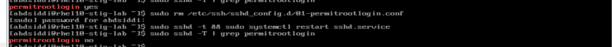

This was actually a good lesson, leftover config files silently overriding your intended setting is a real thing that happens in production hardening work too, not just a lab mistake.

### 6. Verifying the single fix with OpenSCAP

Found the exact rule ID for this specific check and ran a single rule scan instead of the whole profile:

```bash
oscap xccdf eval --profile xccdf_org.ssgproject.content_profile_stig --oval-results /usr/share/xml/scap/ssg/content/ssg-rhel10-ds.xml 2>&1 | grep -i root_login
```


```bash
sudo oscap xccdf eval --rule xccdf_org.ssgproject.content_rule_sshd_disable_root_login --results rootlogin-check.xml --report rootlogin-check.html /usr/share/xml/scap/ssg/content/ssg-rhel10-ds.xml
```

Result came back pass, this was the "green check" moment the tutorial talks about.


### 7. Generating and running the Ansible remediation

Instead of fixing every failed check by hand, generated an Ansible playbook straight from the scan content:

```bash
sudo oscap xccdf generate fix --profile xccdf_org.ssgproject.content_profile_stig --fix-type ansible --output stig-remediate.yml /usr/share/xml/scap/ssg/content/ssg-rhel10-ds.xml
```

This part had the most errors of the whole lab.

**Error 1**, ran `less stig-remediate.yml` before the generate command actually finished, so nothing existed yet.

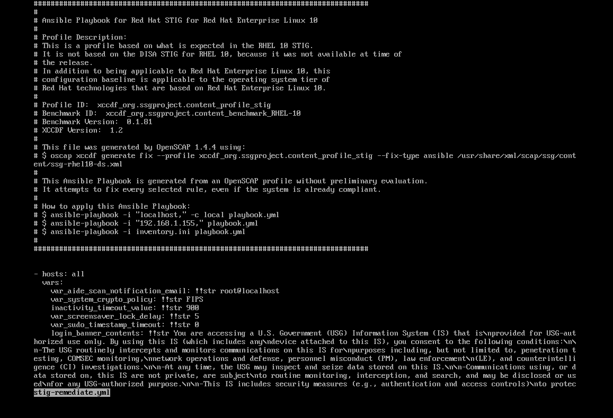

**Error 2**, once it generated properly (2000+ lines), running the playbook failed with a missing Ansible module:

```
ERROR! couldn't resolve module/action 'community.general.ini_file'
```


Installed the missing collection:

```bash
ansible-galaxy collection install community.general
```

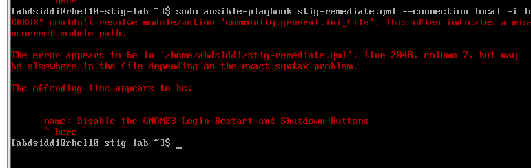

**Error 3**, still failed on the same module. This was because I ran the playbook with `sudo`, which uses root's environment, not the user environment the collection just got installed into. Ansible could not see the collection it had literally just installed.


**Error 4**, the generated yml file was owned by root since it came from a `sudo oscap` command, so my regular user could not even read it.

```
Permission denied: '/home/abdsiddi/stig-remediate.yml'
```

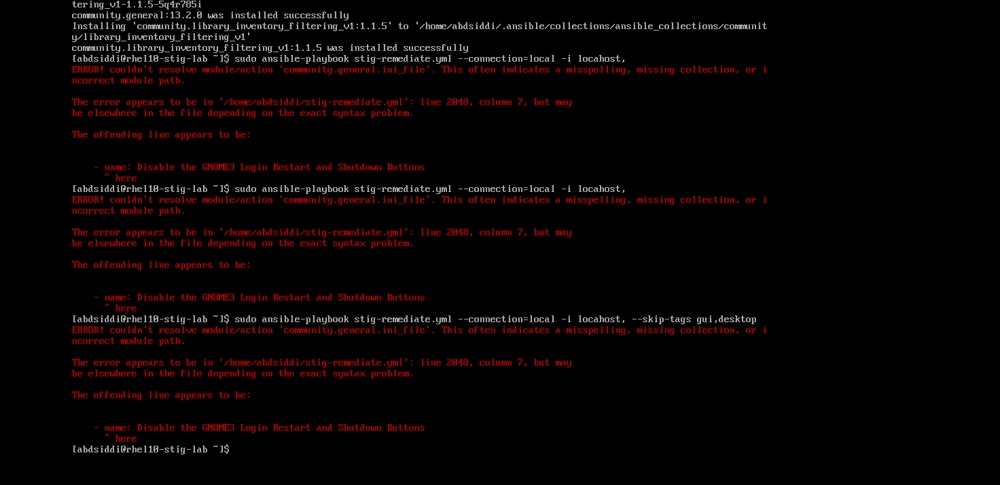

Fixed with:

```bash
sudo chown abdsiddi:abdsiddi stig-remediate.yml
```


**Error 5**, next missing module, this time `ansible.posix.sysctl`.

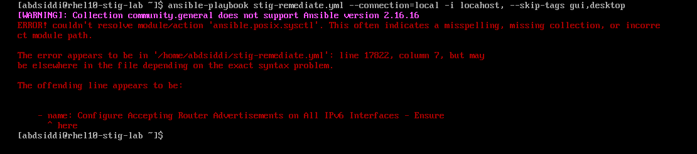

Installed the common collections all at once instead of chasing them one at a time:

```bash
ansible-galaxy collection install ansible.posix community.general community.crypto
```

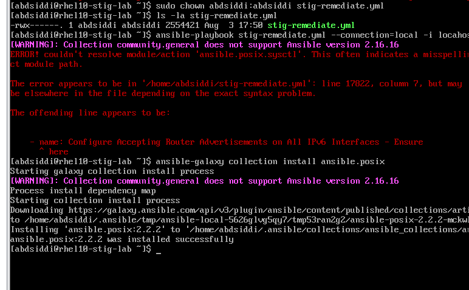

**Error 6**, ran without sudo this time using `--ask-become-pass` and it got much further, but failed on one task (installing `aide`) with "This command has to be run under the root user", meaning become was not fully escalating for that task.


Went back to running it with sudo, but that brought back the original ini_file collection error, since sudo uses root's own collection path, and the collections had only been installed under my regular user.


**Actual fix**, installed the collections again specifically under root, then ran the whole playbook as root with sudo, skipping `become` entirely since it was already root:

```bash
sudo ansible-galaxy collection install ansible.posix community.general community.crypto
sudo ansible-playbook stig-remediate.yml --connection=local -i localhost, --skip-tags gui,desktop
```

This finally ran clean.


### 8. Getting the reports off the VM

Since RHEL was CLI only, I had to scp the HTML reports to my Windows host to actually view them in a browser.

Ran into "permission denied" a few times here too:

- First because I was running scp from inside the VM targeting itself instead of running it from the Windows host
- Then because I was sitting in `C:\Windows\System32` on Windows, which is a protected folder regular users can't write to
- Then because the report file itself was owned by root again since it came from a `sudo oscap` command

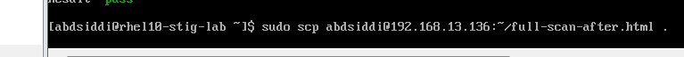
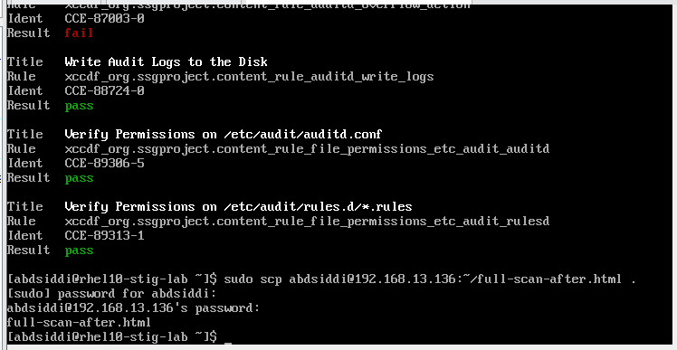

Fixed all three by running scp from a normal folder like Desktop on the Windows side, and re-chowning the file back to my regular user on the VM side before sending it.

### 9. First real results: 71.8 percent

```bash
grep -c 'result>pass' full-scan-after.xml
grep -c 'result>fail' full-scan-after.xml
```

Baseline before any fixes: 180 pass / 274 fail (about 40 percent)
After the first Ansible run: 293 pass / 125 fail

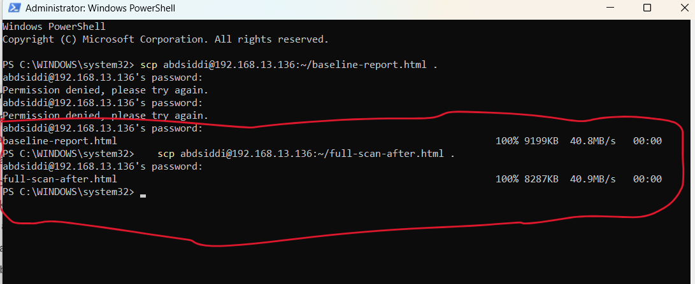

Opened the actual HTML report and the official OpenSCAP scoring engine put it at:

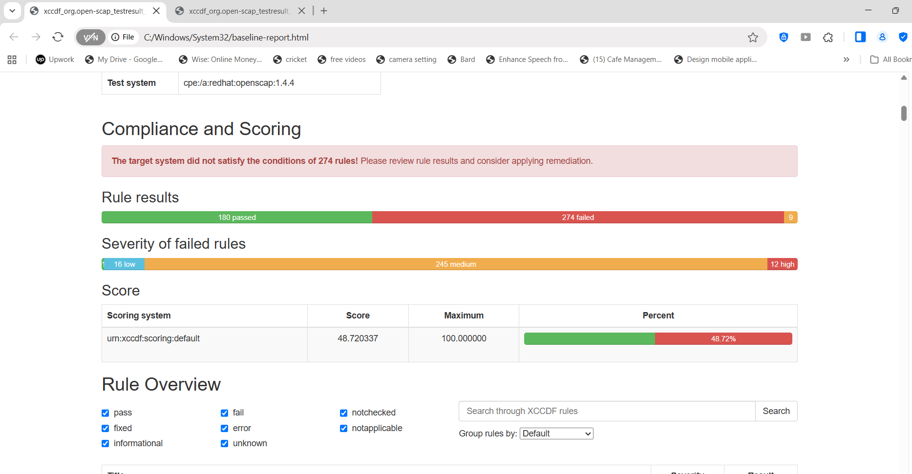

**Score: 71.82%**

### 10. Chasing down the remaining fails

Looked at the failures left, grouped by severity. Out of 125 fails, most were medium severity audit rules (things like recording chmod, chown, sudo usage, kernel module loading, about 70 of the fails were all audit related). There were also 5 high severity fails:

- Enable FIPS Mode
- Set kernel parameter crypto.fips_enabled to 1
- Verify system was booted with fips=1
- Encrypt Partitions
- Set the Boot Loader Admin Username to a Non-Default Value
- Set Boot Loader Password in grub2

FIPS mode and partition encryption are basically not fixable after the fact, Red Hat expects those to be set during install, so those got documented as known limitations instead of chased further.

The GRUB password one was fixable live with `grub2-setpassword`.

The big win was the audit rules. Checked and the rules were already written to disk by the Ansible run, just not loaded into the running system:

```bash
sudo auditctl -l
```

Tried to reload them:

```bash
sudo augenrules --load
sudo systemctl restart auditd
```

This actually failed too, but in a good way:

```
/sbin/augenrules: Audit system is in immutable mode - exiting with no changes
Failed to restart auditd.service: Operation refused, unit auditd.service may be requested by dependency only
```


This was actually one of the STIG controls doing its job, "Make the auditd Configuration Immutable" was one of the passed rules from the Ansible run, so the audit rules genuinely cannot be changed live anymore without a reboot. That's the point of the control.

Rebooted the VM, confirmed the rules loaded with `auditctl -l`, and rescanned.

### 11. Final result: 95.37 percent

Hit a "permission denied" on the new report file too (root owned again from the sudo scan), fixed the same way as before with chown, then pulled it to the host and opened it.


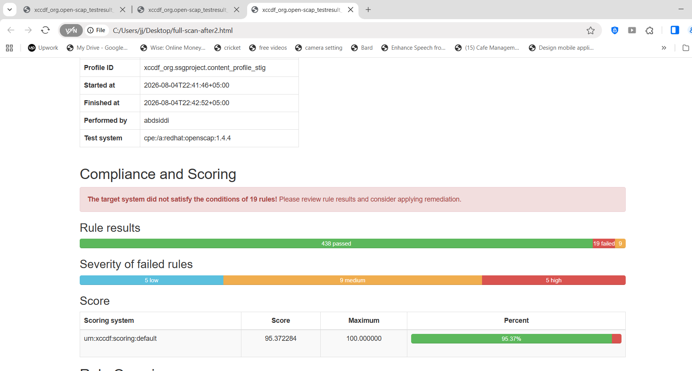

**Final score: 95.37%**
438 passed, 19 failed
Remaining fails: 5 high (FIPS mode + partition encryption, both install time only), 9 medium, 5 low (mostly separate partition rules for /home, /tmp, /var, which also need a reinstall with custom partitioning to fix)

## Summary of results

| Stage | Pass | Fail | Score |
|---|---|---|---|
| Baseline, fresh install | 180 | 274 | ~39.6% |
| After manual SSH fix + first Ansible run | 293 | 125 | 71.82% |
| After fixing audit rule loading + reboot | 438 | 19 | 95.37% |

## What I actually learned from this

- A scan is not the end of the job, reading the failures and knowing which ones are actually fixable versus which ones need a reinstall is the real skill
- Config file precedence in `/etc/ssh/sshd_config.d/` matters, the first file alphabetically wins, leftover files can silently override you
- `sudo` and normal user Ansible runs use completely different collection paths and environments, this cost me the most time in the whole lab
- Files created with `sudo` end up owned by root and will block you later when you try to read, scp, or edit them as your normal user
- Immutable audit configuration is a real STIG control, not a bug, once it's on you need a reboot to change audit rules again
- FIPS mode and disk encryption really do need to be decided at install time, no clean way around that after the fact

## Known limitations / what I would do differently next time

- Would enable FIPS mode and set up encrypted/separate partitions (/home, /tmp, /var, /var/log, /var/log/audit) during the RHEL install itself instead of trying to retrofit them after
- SSSD related checks (certmap, smartcard, trust anchor) need an actual identity provider like AD or FreeIPA to fully pass, out of scope for a single standalone VM
- Would install the ansible collections under root from the very start next time to skip a good chunk of the troubleshooting above
